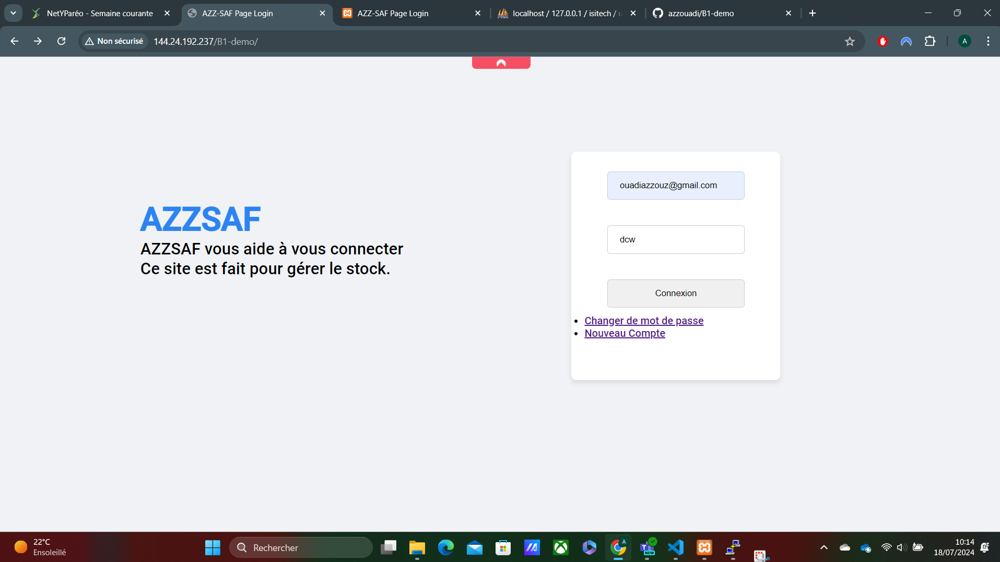
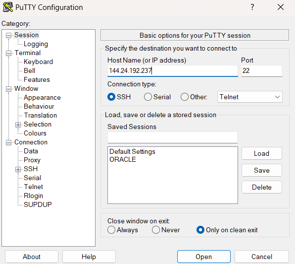
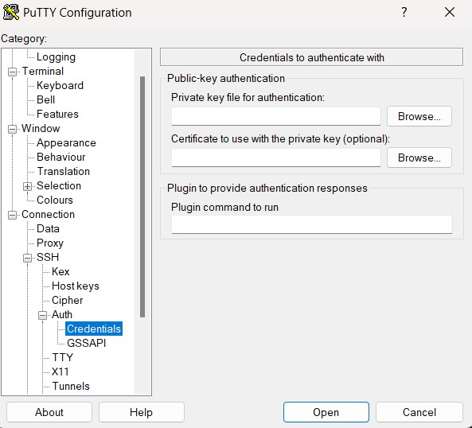

# Connexion au site

Pour se connecter à notre site, c'est très simple. Il suffit d'utiliser ce lien :  
[http://144.24.192.237/B1-demo/](http://144.24.192.237/B1-demo/)



Ensuite, vous accéderez à une page de connexion où vous pourrez vous connecter à la page de gestion de stock de produits pharmaceutiques.

## Déploiement de votre site internet sur Oracle

Je vais maintenant expliquer comment j'ai procédé pour déployer mon site internet sur Oracle :

1. **Création d'une instance Ubuntu sur Oracle :**
   - Tout d'abord, je crée une instance Ubuntu sur Oracle.
   - Ensuite, je choisis l'image de l'OS que je souhaite utiliser.
   - N'oubliez pas de télécharger les clés SSH pour pouvoir les utiliser pour vous connecter à la VM.

## Utilisation de Putty

Je vais maintenant expliquer comment utiliser Putty pour accéder à la VM que nous avons créée :

1. **Configuration de Putty :**
   - Pour utiliser Putty, vous aurez besoin de l'adresse IP de la machine. Saisissez cette adresse dans le champ "Host IP Address".
   - Voici un exemple visuel pour vous guider :  
   
   - Faudra qu'on mette aussi la cle SSh qu'on a telecharge precedemment de la VM , mais avant on va dans Putty Gen pour traduire la cle SSH et pour faire on va dans --> SSH --> Auth --> Credentials --> Private key file for authentification, et on mets la cle SSH qu'on a traduit dans PuttyGEN
   
   - Ensuite on mets Open et on se connecte a la VM


# Configuration de la VM

## Mettre à jour les Paquets

Une fois connecté, mettez à jour les paquets de votre VM :
```bash
sudo apt update
sudo apt upgrade -y
```
## Installer Apache 

Installez le serveur web Apache2 :

```
bash sudo apt install apache2 -y
```

Démarrez Apache2 et assurez-vous qu'il se lance au démarrage :
```
bash sudo systemctl start apache2 sudo systemctl enable apache2
```
Ensuite pour verifier si tout fonctionne correctremnt on mets l'adresse ip de la VM dans un navigateur internet normalmenet on devrait avoir une page APACHE


# Installer PHP

Installer PHP et les Modules Nécessaires :
```
bash sudo apt install php libapache2-mod-php php-mysql -y
```

Redémarrez Apache2 pour charger les modules PHP :
```
bash sudo systemctl restart apache2
```
Créez un fichier info.php dans le répertoire /var/www/html :
```
echo "<?php phpinfo(); ?>" | sudo tee /var/www/html/info.php
```
Pour verifier si tout fonctionne bien on accede a : <b>http://IP-DE-LA-VM/info.php</b> pour verifier si tout fonctionne bien

# Installer MySQL

Installez le serveur MySQL:
```
bash sudo apt install mysql-server -y
```

Exécutez le script de sécurisation de MySQL
```
bash sudo mysql_secure_installation
```
- Suivez les instructions à l'écran pour configurer le mot de passe root et sécuriser l'installation.

- Créer une Base de Données et un Utilisateur :

- Connectez-vous à MySQL en tant que root : bash sudo mysql -u root -p

- Créez une base de données et un utilisateur pour votre application : sql CREATE DATABASE nom_de_votre_base_de_donnees; CREATE USER 'nom_utilisateur'@'localhost' IDENTIFIED BY 'mot_de_passe'; GRANT ALL PRIVILEGES ON nom_de_votre_base_de_donnees.* TO 'nom_utilisateur'@'localhost'; FLUSH PRIVILEGES; EXIT;


# Déployer le site PHP
Déployer les Fichiers de votre Application :
```
On transfere les fichiers de notre code /var/www/html de la VM avec git par exemple ou autrement
```
On s'assure que les fichier ont les bonnes permissions:
```
sudo chmod -R 755 /var/www/html
```
Ensuite on redemarre Apache: 
```
sudo systemctl reload apache2
```


